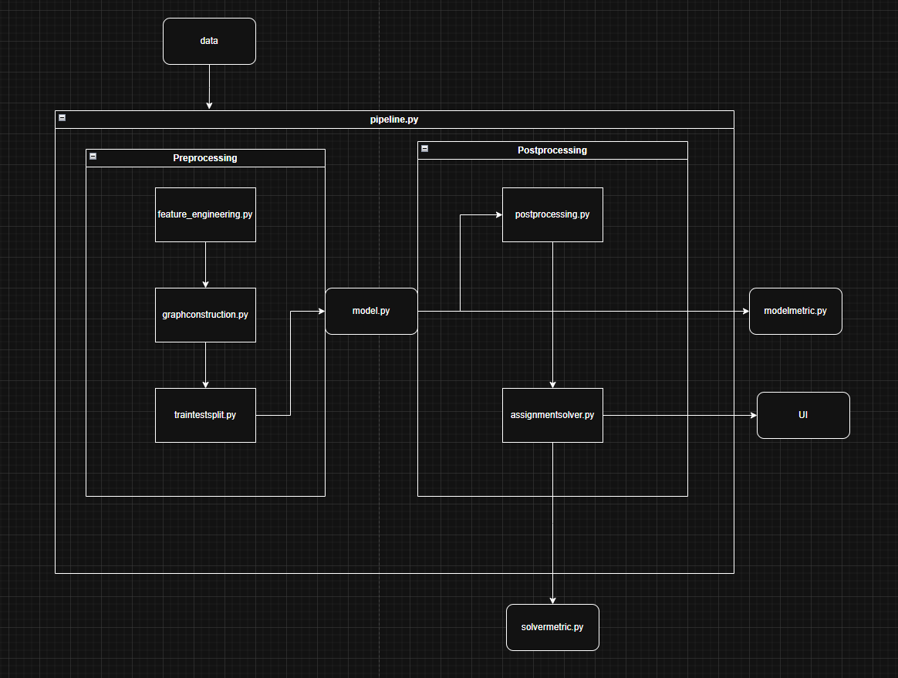

# Nurse Scheduling Optimization using Graph Attention Networks (GAT) & OR-Tools

##  Project Overview

This project aims to solve the complex nurse rostering problem using modern machine learning and combinatorial optimization:
- **Graph Attention Network (GAT)** is used to score and rank nurse–shift assignments based on historical schedules and stated preferences.
- **Google OR-Tools** is used to assign nurses to shifts under real-world constraints (max hours, minimum coverage, preferences, fairness, etc.).

The pipeline is designed to maximize staff satisfaction and roster efficiency in hospital wards.

---

## Workflow

1. **Data Preparation**  
   - Combine historical nurse schedules and preference datasets.
   - Engineer features such as hours worked, days since last shift, shift/ward type, etc.

2. **Graph Construction**  
   - Build a bipartite graph with nurses and shift-slots as nodes.
   - Edges represent possible assignments, with rich node/edge features.

3. **Modeling with GAT**  
   - Train a Graph Attention Network to predict suitability of each nurse–shift pair.

4. **Shift Assignment with OR-Tools**  
   - Use the GAT scores and hard constraints to optimize final nurse-shift assignments.

5. **Evaluation & Visualization**  
   - Measure performance with Hit@1, fairness, solve time, and coverage.
   - Visualize and export planned rosters for deployment or review.

---

## Key Files & Scripts

- `src/dataprep/graphconstruction.py` – Builds PyTorch Geometric graphs from tabular data.
- `src/dataprep/feature_engineering.py` – Adds features like hours worked, days since last shift, etc.
- `src/model/gat.py` – GAT model definition.
- `src/inference/googleor.py` – OR-Tools assignment logic using GAT outputs.
- `src/utils/metrics.py` – Evaluation and reporting tools.
